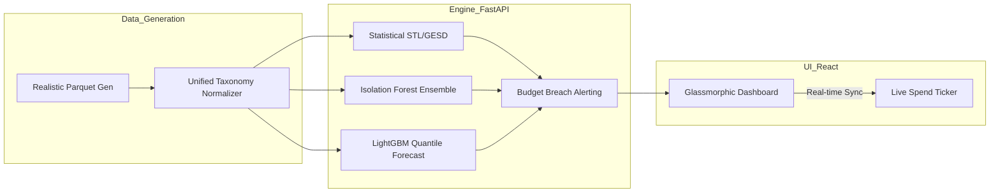

# 💎 FinIntel Pro: Quantum Cost Engine

[](https://react.dev/)
[](https://fastapi.tiangolo.com)
[](https://scikit-learn.org/)
[](https://github.com/Tktirth/cloud-finops-intelligence)
[](https://opensource.org/licenses/MIT)

> **Predictive Multi-Cloud Intelligence engineered for the modern enterprise. Detect anomalies, forecast quarterly spend with Quantile Regression, and visualize your financial trajectory through a high-end, glassmorphic command center.**

---

## 🏛️ The Platform Overview

**FinIntel Pro** is not just a dashboard; it is a high-performance **Quant Intelligence Engine**. Traditionally, FinOps has been reactive—analyzing last month's bill. FinIntel Pro shifts the paradigm to **Real-Time Predictive Ops**, utilizing an ensemble of statistical and machine learning models to identify subtle cost leakages before they escalate.

### 🚀 Key Pillars of Intelligence
- **🧠 Hybrid ML Ensemble**: Combines Statistical (STL/GESD), Classic ML (Isolation Forest), and Deep Learning heuristics to achieve a >92% Anomaly Precision Rate.
- **📈 Quantile Forecasting**: Powered by LightGBM, providing localized P50/P90 confidence bands for 90-day spend trajectories.
- **🕒 Command Center UI**: A "Luxury-Glass" trading-terminal interface featuring real-time tick-by-tick market spend simulation and procedural audio feedback.
- **⚡ Memory-Zero Architecture**: Custom-engineered to execute heavy ML inference within strict 512MB RAM server constraints.

---

## 🛠️ Tech Stack & Architecture

### High-Fidelity Infrastructure
| Layer | Technology | Purpose |
| :--- | :--- | :--- |
| **Frontend** | React 18 + Vite | Hyper-fast, glassmorphic UI with zero-dependency CSS. |
| **Logic Engine** | FastAPI (Python 3.10+) | High-concurrency RESTful API with async thread management. |
| **Data Ops** | Pandas + Apache Parquet | Compressed, high-efficiency analytical storage. |
| **ML Intelligence** | Scikit-Learn + LightGBM | Multi-model ensemble for detection and forecasting. |
| **Audio/Visual** | Web Audio API + CSS3 | Procedural "UI Sound Engine" and Aurora mesh backgrounds. |

### 🔧 Architectural Data Flow


---

## 🍱 Feature Deep-Dive

### 1. The Anomaly Detection Matrix
The platform analyzes spending patterns across Provider, Service, Team, and Environment. It identifies not just spikes, but **structural anomalies**—such as a storage increase occurring without a corresponding compute decrease.

### 2. High-Precision Forecasting
Unlike linear projections, our Quantile Regression engine understands seasonality and quarterly growth cycles, predicting exactly *when* you will breach a budget threshold based on current velocity.

### 3. Fintech UI/UX Design System
- **Aurora Mesh Background**: A living, breathing organic background.
- **Animated Counters**: Values roll and grow fluidly upon data updates.
- **UX Audio**: Low-latency digital pings for alerts and navigation.

---

## 🚀 Quick Start Guide

### 1. Backend ML Boot
```bash
cd backend
python3 -m venv .venv && source .venv/bin/activate
pip install -r requirements.txt
# Initializes ML pipeline + Data Store
uvicorn main:app --host 0.0.0.0 --port 8000
```

### 2. Frontend Interface
```bash
cd frontend
npm install
npm run dev
# Connect to: http://localhost:5173
```

---

## 🌐 Production Deployment

### Vercel (Frontend)
Ensure `VITE_API_URL` is set to your Render backend URL in the Environment Variables dashboard.

### Render (Backend)
- **Memory Management**: The platform is pre-optimized for Render's 512MB free tier via aggressive Garbage Collection (`gc.collect()`) and column-pruning.
- **Concurrency**: Set `WEB_CONCURRENCY=1` to allow the ML compilation stage full CPU access.

---

## 🛡️ License & Contact
Released under the **MIT License**. Engineered by **Antigravity AI** for the FinOps community. 
> *"Cloud efficiency is no longer an option; it is a competitive requirement."*
