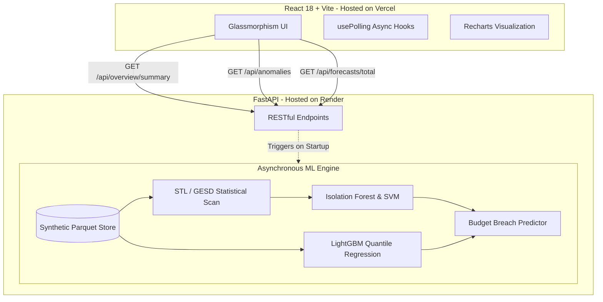

# ☁️ Cloud FinOps Intelligence Platform

[](https://react.dev/)
[](https://fastapi.tiangolo.com)
[](https://scikit-learn.org/)
[](https://vercel.com)
[](https://render.com)
[](https://opensource.org/licenses/MIT)

> **An enterprise-grade, real-time AI-powered FinOps platform engineered to detect multi-cloud cost anomalies, accurately forecast future spend, and alert on impending budget breaches before they escalate.**

## 📖 The Business Problem
Organizations operating across AWS, Azure, and Google Cloud face an escalating challenge: cloud spend grows 20-30% year-over-year, yet engineering teams lack the predictive intelligence to detect cost anomalies (e.g., misconfigured auto-scaling, runaway data egress, abandoned clusters) before they snowball into massive end-of-month bills. Existing tools are reactive; they report on what happened *last month*.

**Cloud FinOps Intelligence** shifts this paradigm from reactive to *predictive*. By synthesizing an ensemble of robust Machine Learning models, the platform proactively identifies subtle financial discrepancies and generates highly accurate spend forecasts across high-dimensional architectural features (Provider, Service, Team, Environment).

---

## 🏗️ System Architecture

The platform operates on a modernized, decoupled client-server architecture, specifically optimized to run heavy Machine Learning inference within strict 512MB RAM cloud constraints using lightweight Gradient Boosting variants.



### 1. `backend/` (FastAPI + Python ML)
- **Data Foundation Layer**: Continuously generates large-scale structural schemas modeled around standard multi-cloud billing formats, stored immutably in highly-compressed `.parquet` formats.
- **Inference Pipeline**: A decoupled, high-performance execution of ML stages built dynamically on application boot. 
- **RESTful Endpoints**: Extremely fast routing using `uvicorn` and FastAPI definitions, natively serializing multidimensional pandas targets.

### 2. `frontend/` (React 18)
- **Glassmorphism Design System**: Built strictly with CSS Modules and inline styles, eliminating Tailwind dependencies to achieve maximum aesthetic control and custom CSS variable-driven themes.
- **Dynamic Polling Hook**: Incorporates a custom `usePolling(60000)` hook handling asynchronous HTTP data hydrates to bridge the gap between instant UI painting and heavy ML backend calculation latency.
- **Recharts Integration**: Multi-series, responsive graphing capabilities mapping live forecasting trajectories visually matching the P50, P90 bounding confidence boxes.

---

## 🧠 The Machine Learning Pipeline

The orchestrator executes an intense sequence during the FastAPI `startup` event, designed to bypass HTTP blocking organically via `asyncio.to_thread()`:

1. **Statistical Scanning**: Applies `statsmodels` Seasonal-Trend Decomposition (STL) and Generalized Extreme Studentized Deviate (GESD) algorithms to build foundational baseline thresholds.
2. **Anomaly Density Identification**: Utilizes `scikit-learn` Isolation Forests to detect high-dimensional, multivariate density anomalies (e.g., matching a compute spike to a simultaneous networking drop).
3. **Live Forecasting**: Executes advanced LightGBM Gradient Boosting Quantile Regression to yield exact budget breach capabilities with localized P50 and P90 bounding boxes, intelligently bypassing heavier frameworks (Prophet/PyTorch) to operate flawlessly under ultra-constrained memory footprints.
4. **Attribution & Alerts**: Unifies the vectors via an Ensemble agreement logic and pushes the final processed array into internal cache for rapid API extraction.

---

## 🚀 Deployment Strategy

This application is fully containerized and production-ready for immediate PaaS distribution.

* **Frontend Deploy:** Deployed globally to the Edge via Vercel. Continuous Integration linked to the `main` branch.
* **Backend Deploy:** Deployed to Render Web Services. The `uvicorn` server automatically utilizes `WEB_CONCURRENCY=1` to dedicate 100% of the virtual CPU towards the initial ML compilation step.
* **Cold Start Management:** Managed via Cron automated heartbeats hitting `GET /api/debug-ml`, ensuring the Python background thread never drops the computed Pandas array from memory, guaranteeing instantaneous `<0.05s` latency for dashboard visitors.

---

## 🛠️ Local Quick Start 

### Prerequisites:
- Python 3.10+
- Node.js 18+

### Step 1: Start the AI Backend
```bash
cd backend
python3 -m venv .venv
source .venv/bin/activate
pip install -r requirements.txt

# Boot the uvicorn server (Will execute the 3-minute ML pipeline loop)
uvicorn main:app --host 0.0.0.0 --port 8000
```

### Step 2: Start the React Dashboard
```bash
# Open a new terminal instance
cd frontend
npm install
npm run dev
```

Navigate to **http://localhost:5173** to view your running FinOps Intelligence Platform!

---

## 🛡️ License
Released under the [MIT License](LICENSE). 
